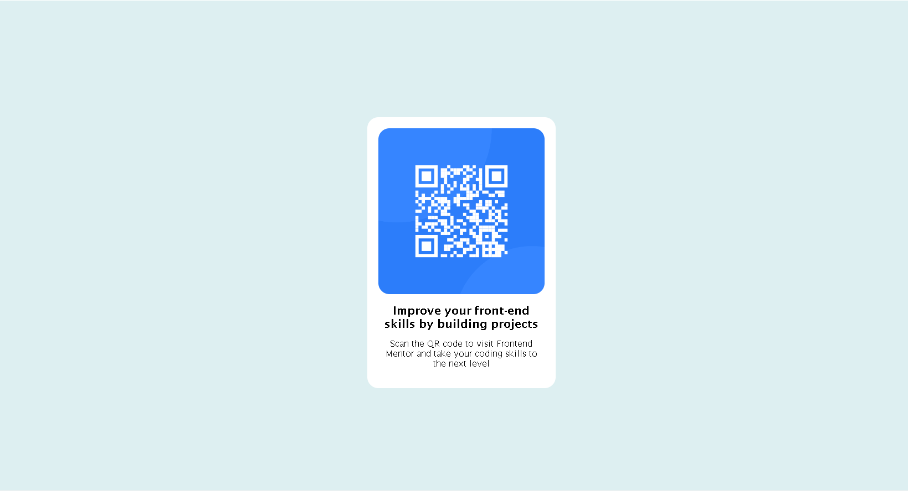

# Frontend Mentor - QR code component solution


## Table of contents

- [Overview](#overview)
  - [Screenshot](#screenshot)
  - [Links](#links)
- [My process](#my-process)
  - [Built with](#built-with)
  - [What I learned](#what-i-learned)
  - [Continued development](#continued-development)
  - [Useful resources](#useful-resources)
- [Author](#author)


**Note: Delete this note and update the table of contents based on what sections you keep.**

## Overview

### Screenshot




### Links

- Solution URL: [Add solution URL here](https://your-solution-url.com)
- Live Site URL: [Add live site URL here](https://your-live-site-url.com)

## My process

### Built with

- Semantic HTML5 markup
- CSS custom properties
- Flexbox

### What I learned

With this challenge I learn how to do a responsive page.

To see how you can add code snippets, see below:

```html
<h1>Some HTML code I'm proud of</h1>
<div class="qr">
      
    </div>
```
```css
.proud-of-this-css {
 @media only screen and (max-width: 400px) {
    .contenedor {
        max-width: none; /* Eliminar el ancho máximo para que el div se ajuste al tamaño de la pantalla */
        padding: 10px; /* Reducir el relleno en pantallas pequeñas */
    }
}
}


### Continued development

I want to continue improving my skills in web developing by doing challenges with javascript and reactJS

### Useful resources

- [Example resource 1](https://www.genbeta.com/desarrollo/responsive-design-estructura-adaptable) - This helped me for do the responsive page

## Author

- Website - [Leyla Vasquez](https://www.legive-dev.com)
- Frontend Mentor - [@legive](https://www.frontendmentor.io/profile/legive)


